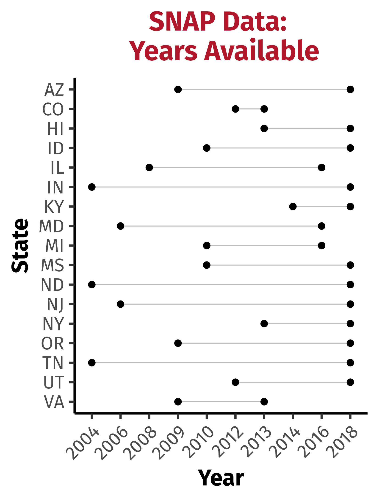
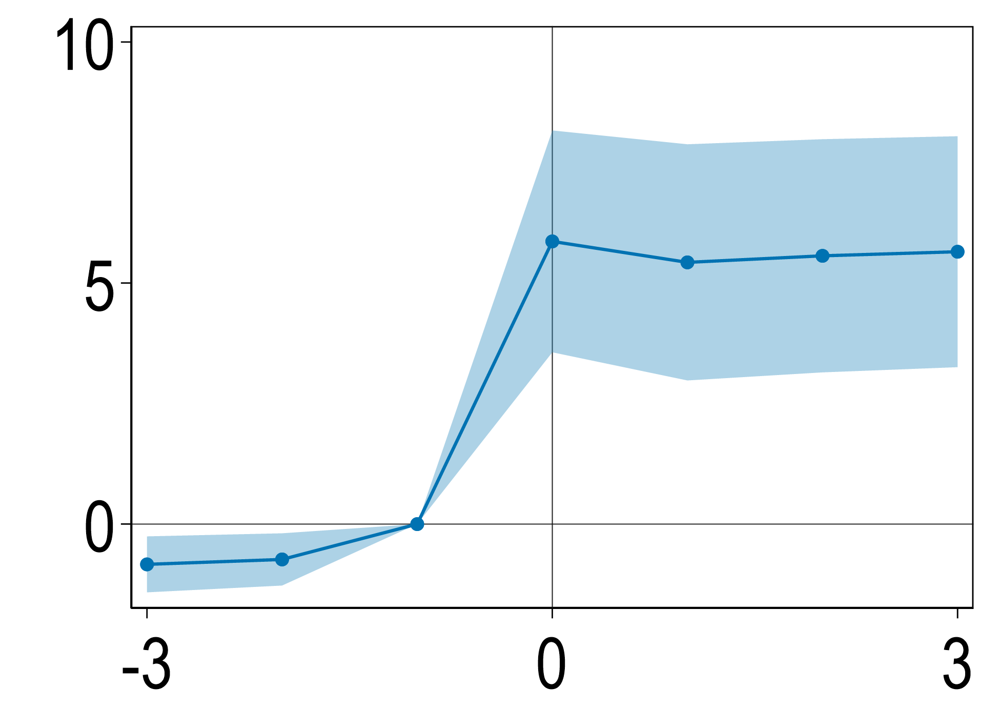
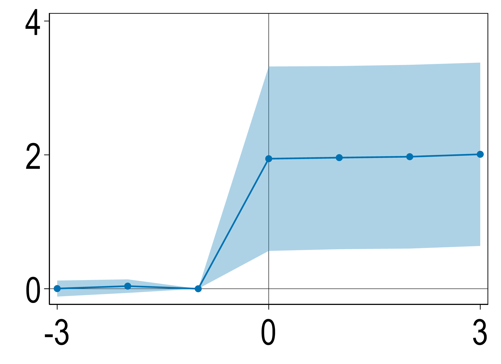
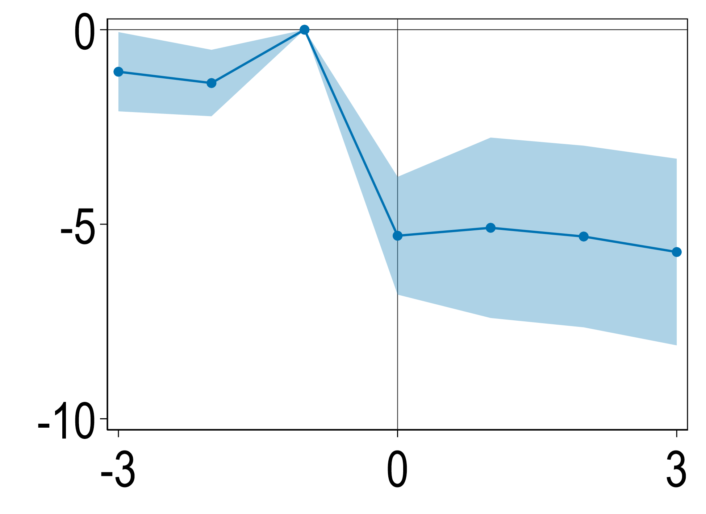
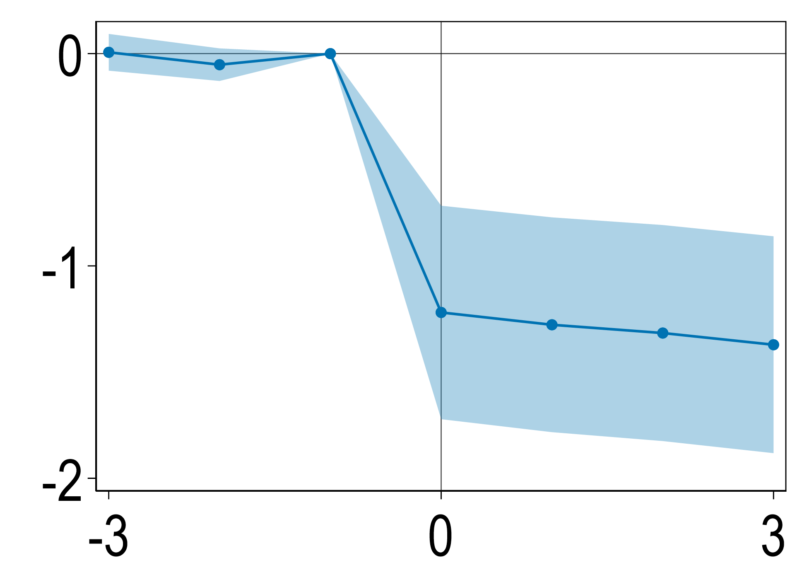
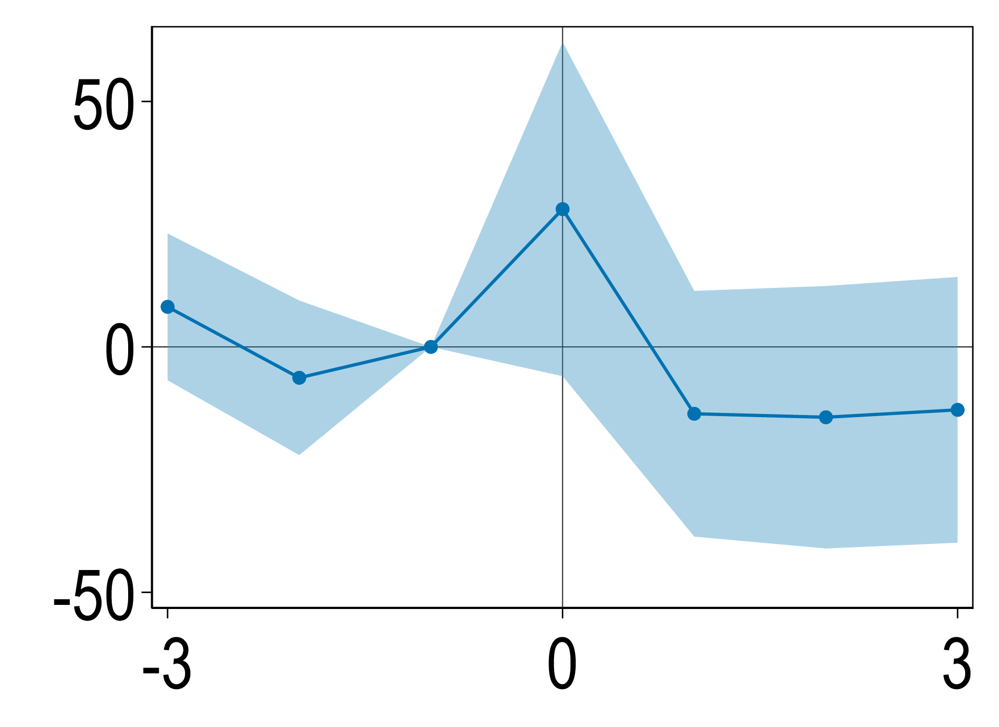
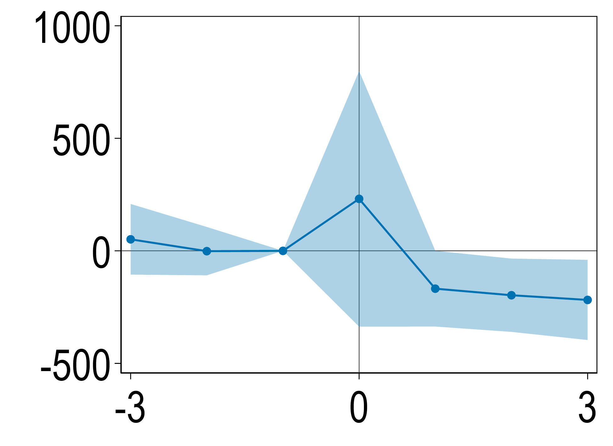
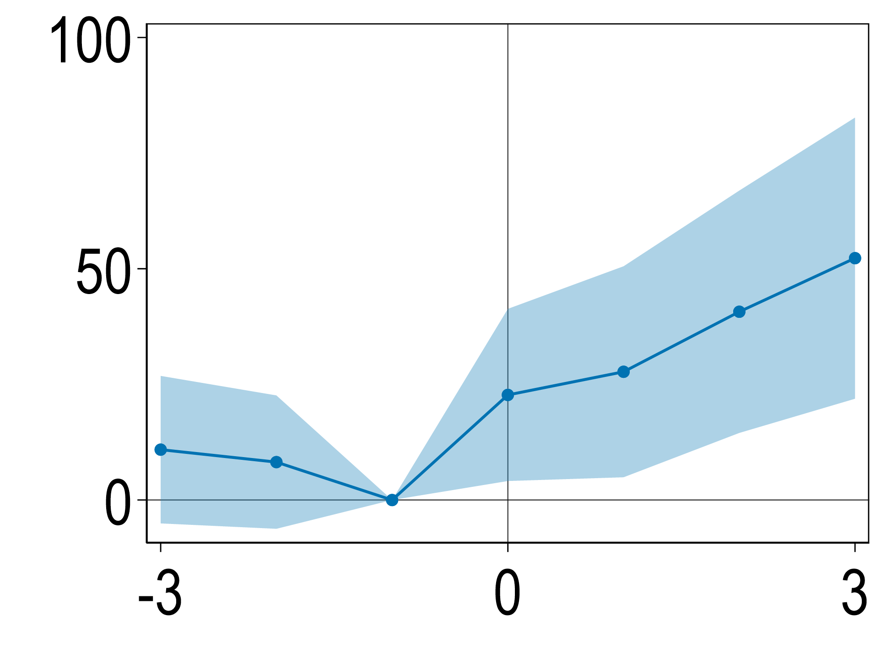
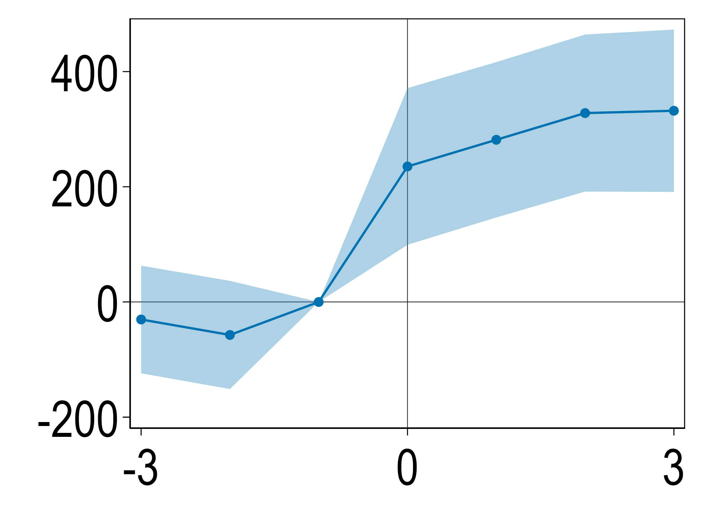

htmltools::includeCSS("https://raw.githubusercontent.com/jasoncookecon/SNAP_Distance/blob/main/my-css.css")

# Disclaimer

> Any opinions and conclusions expressed herein are those of the authors and do not reflect the views of the U.S. Census Bureau. The statistical summaries reported in this paper have been cleared by the Census Bureau's Disclosure Review Board release authorization number CBDRB-FY21-CES014- 049. All results have been reviewed to ensure that no confidential information is disclosed.


---

```{r, load_refs, include=FALSE, cache=FALSE}
library(RefManageR, here)
BibOptions(check.entries = FALSE,
         bib.style = "authoryear",
         cite.style = "authoryear",
         max.names = 2,
         sorting = "nty",
         style = "markdown",
         hyperlink = FALSE,
         dashed = TRUE)
bib <- RefManageR::ReadBib("SNAP_WIC.bib", check = FALSE)
```
```{r initialize, include = F}
if (!require("pacman")) install.packages("pacman")
pacman::p_load(grid, gridExtra,ggrepel, sp, foreign, dplyr, ggplot2, ggridges, tidyr, forcats, colortools, patchwork, plotly, dygraphs, knitr, kableExtra, formattable,datasets, reactable, htmltools, magick, timevis,ggpubr)

library(ggplot2, grid, reactable)
library(htmltools)
library(gridExtra)
library(ggridges)
library(dplyr)
library(tidyr)
library(forcats)
library(colortools)
library(patchwork)
library(ggrepel, plotly, dygraphs)
library(knitr, kableExtra, formattable)
library(datasets, readxl)
library(ggpubr)
crop <- function(im, left = 0, top = 0, right = 0, bottom = 0) {
 d <- dim(im[[1]]); w <- d[2]; h <- d[3]
 image_crop(im, glue::glue("{w-left-right}x{h-top-bottom}+{left}+{top}"))
}
```
```{r xaringanExtra-scribble, echo=FALSE}
xaringanExtra::use_xaringan_extra(c("tile_view", "freezeframe")) #, "scribble"
```

<!-- install.packages(c("pagedown", "xaringan")) -->
<!-- pagedown::chrome_print("C:/Users/Jason/Documents/GitHub/SNAP_Distance_12_minutes/SNAP_Distance_Bitler_Cook_Porter_12_min.html") -->

# Motivation

- US somewhat unique within advanced economies in design of safety net. System very federalized with various levels of government running programs.

- People apply to many programs and rules not harmonized and application is not automatic as in much of the developed world $\Rightarrow$ low take-up is more of issue in US than other places (.smallest[.red[Currie, 2006; Currie and Gahvari, 2008]]). 

- Social program take-up: Hot topic in public econ, yet understudied.
  - Emphasis on understanding role of barriers to accessing safety net.
  
-  Barriers impact both .hi-red[take-up] (how many people enroll) and .hi-red[targeting] (what types of people enroll). 

---

# SNAP

- Backbone of US safety net.

- Only US safety net program available to nearly all low-income households.

- Many potential barriers to access and rich literature studying these barriers.

`r RefManageR::NoCite(bib, c("Currie2006","Currie2008a"))`

---
# Literature

- Studies have explored .hi-red[take-up] and .hi-red[targeting] effects of SNAP policies/interventions

  - Information interventions (.smallest[.red[Daponte, Sanders, & Taylor, 1999; Finkelstein and Notowidigdo, 2019]])

  - Application help (.smallest[.red[Schanzenbach, 2001; Finkelstein and Notowidigdo, 2019]])

  - Certification rules and recertification interviews (.smallest[.red[Kabbani and Wilde, 2003; Homonoff and Somerville, 2021, Unrath, 2021]])

  - Simplified reporting requirements (.smallest[.red[Gray, 2018; Hanratty, 2006]])

  - Automated application process (.smallest[.red[Wu, 2021]])

- No evidence for improvements in both take-up and targeting

`r RefManageR::NoCite(bib, c("Daponte1999","Bhargava2015","Deshpande2019","Ebenstein2010","Homonoff2020","Finkelstein2019b","Daponte1999","Bartlett2004","Bhargava2015","Armour2018","Bettinger2012","Schanzenbach2009","Kabbani2003b","Hanratty2006","Deshpande2019","Rossin-Slater2013","Ambrozek2021","Unrath2021a","Wu2021","Gray2018","Barnes2021","Barnes2021a","Whaley2021","Vasan2021"))`


---

# Our Contribution

- First assessment of how access to in-person assistance via opening/closing SNAP offices and SNAP-authorized stores impacts participation and targeting.

- Provide evidence that reducing transaction costs via access to SNAP offices .hi-green[increases participation] and .hi-green[improves targeting].

--

- Link Census data on residential location with administrative SNAP data and information on SNAP offices and SNAP-authorized retailers.

- Not possible to study this question with existing surveys due to limited sample sizes and data quality issues.


- Study population within states and don’t have to focus samples with limited generalizability.


`r RefManageR::NoCite(bib, c("Handbury2021","Rossin-Slater2013","Meckel2020b"))`

---
class: inverse, middle
count: false 

# Institutional Background & Data

---
# SNAP 
## Role of SNAP Offices

- Provide in-person assistance navigating application process.

- **Application prevalence**: .hi-red[in-person] $>$ online $>$ fax $>$ email $>$ phone.

  - SNAP offices report that typically 80% of applications are in person.
  
- Typically provide resources to connect SNAP applicants to other assistance programs (e.g., HUD, TANF, Medicaid/Medicare, LEAP, WIC).

- Some offices allow .red[direct applications to other programs] (typically TANF, but also sometimes HUD and Medicaid).

- Some offices even help find jobs, daycare, and housing.


---


# Data

``` {r, data, echo=F, include=F}
data <- data.frame(
  id      = 1:17,
  state = c("AZ"  ,"CO"  , "HI" , "ID" , "IL" , "IN" , "KY" , "MD" , "MI" , "MS" , "ND" , "NJ" , "NY" , "OR" , "TN" , "UT" , "VA"),
  data_start   = c("2009","2012","2013","2010","2008","2004","2014","2006","2010","2010","2004","2006","2013","2009","2004","2012","2009"),
  data_end     = c("2018","2013","2018","2018","2016","2018","2018","2016","2016","2018","2018","2018","2018","2018","2018","2018","2013")
)

data_long <- data %>% pivot_longer(cols = starts_with("data_"),
                        names_to = "cat",
                        names_prefix = "data_"
)  %>% arrange(desc(state), value)

theme_set(theme_bw())


factor_var <- factor(data_long$state, 
                     order = TRUE,
                     levels=c("VA","UT","TN","OR","NY","NJ","ND","MS","MI","MD","KY","IN","IL","ID","HI","CO","AZ"))

data_long <- data_long %>%
                mutate(state = factor_var)

data_long %>% 
  ggplot(aes(x= value, y= state)) +
  geom_line(aes(group = id),color="grey")+
  geom_point( size=3, show.legend = FALSE) +
  labs(y="State", x="Year") + ggtitle("SNAP Data: \n Years Available") +
  theme_classic(24)+
  theme(axis.text.x = element_text(angle = 45, hjust = 1,family='Fira Sans'),
        axis.text.y = element_text(family='Fira Sans'),
        axis.title.x = element_text(face="bold", family='Fira Sans'),
        axis.title.y = element_text(face="bold", family='Fira Sans'),
        plot.title = element_text(color="#B2182B", face="bold", hjust = 0.5, family='Fira Sans')
        )

ggsave(
  "SNAP_data.png",
  path = 'C:/Users/Jason/Box/SNAP/Distance/Presentation/figs/',
  width = 14,height = 18.5,units = c("cm")
)
```

.pull-left[
- SNAP Administrative Data

- Master Address File

- MAFARF

- HUD Administrative Data

- ACS

- HHS TANF Administrative Data

- Collected 243 SNAP office closings and 336 openings.
]
.pull-right[
 <!-- - **AZ** ('09-'18), **CO** ('12,'13), **HI** ('13-'18), **ID** ('10-'18), **IL** ('08-'16), **IN** ('04-'18) **KY** ('14-'18), **MD** ('09-'16), **MI** ('10-'16), **MS** ('10-'18), **ND** ('04-'18), **NJ** ('06-'18), **NY** ('13-'18), **OR** ('09-'18), **TN** ('04-'18), **UT** ('12-'18), **VA** ('09-'13) -->
.center[]
]
---
# Measuring Access to SNAP Offices

- We count number of SNAP recipients in administrative records residing within given distance to each SNAP office in each year.

- In the case of overlap, we assign case to the closest office (i.e., .red["No Overlap"]).

- Most analyses focus on SNAP cases within **1 mile of the SNAP Office**.

  - Roughly **25th percentile** of distance distribution for both rural and urban counties.
  
---
# Share Affected by Openings/Closings

### Meaningful share of recipients live near SNAP offices

- Of the .hi-red[27,540,000 rural clients] we observe: <sup>*<sup/>

  - 695,000 live < 1 mile of opening office (781,000 for closing office).
  
- Of the .hi-blue[24,590,000 urban clients] we observe:

  - 452,000 live < 1 mile of opening office (843,000 for closing office).
  
.footnote[<sup>*</sup>  Recall we only observe a subset of states in administrative data.]

---
class: inverse, middle
count: false 

# Empirical Design


---

# Empirical Design

## Preferred Specification - Two-way Fixed Effects

$$y_{it} = \sum_{\tau, \tau\neq 1}\beta_\tau 1(t-E_i = \tau) + \gamma_i + \theta_t + \epsilon_{it}$$
- $i\ -$ SNAP office

- $t\ -$ calendar year

- $E_i\ -$ year of opening/closing

--

- Panel design hinges on exogenous timing of openings/closings.

  - Unobserved determinants of SNAP participation not differentially trending  across office types.


---

# Empirical Design

$$y_{it} = \sum_{\tau, \tau\neq 1}\beta_\tau 1(t-E_i = \tau)+  \gamma_i + \theta_t + \epsilon_{it}$$

- Run on a panel balanced over main event times $\tau \in [-3,3]$.

- Coefficients estimated for all event times, but only report $\tau \in [-3,3]$.

- Cluster standard errors by SNAP office (location where SNAP office will be/is/used to be).

--


- Test robustness to heterogeneous treatment effects (.smallest[.red[de Chaisemartin and D'Haultfœuille, 2020]]).
  
`r RefManageR::NoCite(bib, c("DeChaisemartin2020"))`  
  
---
class: inverse, middle
count: false 

# Results

---
# Mean Distance to Office (Miles)

- .hi-red[Goal:] Measure how travel distances are impacted by SNAP office openings/closings.

- Use the Census Master Address file (MAFX); a static file of all known residential locations in US.

- Measure average travel distance from every MAFX address within 1 of SNAP Office during years leading up to and following opening/closing.

---
# Mean Distance to Office (Miles)
.center[
``` {r, echo=F}
d<-data.frame(Type= c('Distance','Model','Avg. Estimate','Baseline Y','Event Study'), 
               cl_rur = c('0-1','TWFE','5.63***<br/>(1.16)', '.56','
'),
               cl_urb = c("0-1","TWFE","1.97***<br/>(0.70)",".63",'
'),
               op_rur = c("0-1","TWFE","-5.35***<br/>(1.03)","5.3",'
'),
               op_urb = c("0-1","TWFE","-1.30***<br/>(0.26)","1.6",'
')
)

d %>%
  kbl(booktabs = TRUE,col.names = c("","Closing<br/>Rural","Closing<br/>Urban","Opening<br/>Rural","Opening<br/>Urban"), escape = FALSE,
      align=c("c", 'c','c','c','c'), position="center"
  ) %>%
  kable_paper(full_width = FALSE) %>%
  kable_styling(full_width = FALSE, position="center") %>% 
  row_spec(0, align = "c") %>%
  column_spec(1, width = "4em") %>%
  column_spec(2, width = "7em",background ="#FDDBC7") %>%
  column_spec(3, width = "7em",background ="#D1E5F0") %>%
  column_spec(4, width = "7em",background ="#FDDBC7") %>%
  column_spec(5, width = "7em",background ="#D1E5F0") %>%
  row_spec(5, background ="white")
```
]
.caption[.center[
**Data Source:** SNAP Administrative Data - various states and years; Census Master Address File (MAFX).
]]

---
# Mean Distance to Office (Miles)

- .hi-red[Rural Counties]: Open/closings change average distance by 5 miles.

- .hi-blue[Urban Counties]: Open/closings change average distance by 1-2 miles.

- **Key Takeaway:** Distances change enough to move from office being walkable to requiring transit to access.

--

Next, we explore impact of SNAP office closings and openings on total counts of new SNAP clients living within a mile radius.

---
# \# of New SNAP Clients 
## Office Closings
.smallest[]
.pull-left[
```{r , include=T, echo = F}
d<-data.frame(Type= c('Distance','Model','Avg. Estimate','Baseline Y','Event Study'), 
               cl_rur = c('0-1','TWFE',"-3.17<br/>(12.6)","224",'
'),
               cl_urb = c("0-1","TWFE","-88.0<br/>(62.5)","1,020",'
')
)


d %>%
  kbl(booktabs = TRUE,col.names = c("","Closing<br/>Rural","Closing<br/>Urban"), escape = FALSE,
      align=c("c", 'c','c'), position="center"
  ) %>%
  kable_paper(full_width = FALSE) %>%
  kable_styling(full_width = FALSE, position="center") %>% 
  row_spec(0, align = "c") %>%
  column_spec(1, width = "5em") %>%
  column_spec(2, width = "7em",background ="#FDDBC7") %>%
  column_spec(3, width = "7em",background ="#D1E5F0") %>%
  row_spec(5, background ="white")
```
.caption[.center[
**Data Source:** SNAP Administrative Data - various states and years.
]]
]
.pull-right[
- **Rural & Urban Counties**: Temporary spike during closing year.

- .hi-blue[Urban Counties:] 3 years after closing, roughly 90 fewer clients (.blue[8.8% decrease relative to baseline]).
]

---

# \# of New SNAP Clients
## Heterogeneity by Gross Income
.pull-left[
.center[
**Closing, Rural**
```{r out.width = '100%', echo = F}
"figs/cl_rur_fplhet_ES.png" %>%
 image_read() %>%
 crop(bottom = 0, top = 0, left=0, right=0)
```
]
]

.pull-right[
.center[
**Closing, Urban**
```{r out.width = '100%', echo = F}
"figs/cl_urb_fplhet_ES.png" %>%
 image_read() %>%
 crop(bottom = 0, top = 0, left=0, right=0)
```
]
]

.caption[.center[
**Data Source:** SNAP Administrative Data - various states and years.
]]

- **Puzzle:** Temporary spike driven by cases with gross income `\( \in (0,100] \)` %FPL.

- Participation falls for clients with no gross income.


---

# \# of New SNAP Clients
## Office Openings
.smallest[]
.pull-left[

.center[
```{r , include=T, echo = F}
d<-data.frame(Type= c('Distance','Model','Avg. Estimate','Baseline Y','Event Study'), 
               op_rur = c("0-1","TWFE","35.9***<br/>(11.9)","153",'
'),
               op_urb = c("0-1","TWFE","294.2***<br/>(60.7)","466",'
')
)


d %>%
  kbl(booktabs = TRUE,col.names = c("","Opening<br/>Rural","Opening<br/>Urban"), escape = FALSE,
      align=c("c", 'c','c'), position="center"
  ) %>%
  kable_paper(full_width = FALSE) %>%
  kable_styling(full_width = FALSE, position="center") %>% 
  row_spec(0, align = "c") %>%
  column_spec(1, width = "5em") %>%
  column_spec(2, width = "7em",background ="#FDDBC7") %>%
  column_spec(3, width = "7em",background ="#D1E5F0") %>%
  row_spec(5, background ="white")
```
]
.caption[.center[
**Data Source:** SNAP Administrative Data - various states and years.
]]

]
.pull-right[
- **Rural & Urban Counties**: Large, immediate impacts that increase with time.

- By **three years** after opening:

  - .hi-red[Rural Counties]: 53 additional SNAP clients (.red[35% increase]).
  
  - .hi-blue[Urban Counties]: 332 additional SNAP clients (.blue[71% increase]).
]

---

# \# of New SNAP Clients
## Heterogeneity by Gross Income

.pull-left[
.center[
**Opening, Rural**
```{r out.width = '100%', echo = F}
"figs/op_rur_fplhet_ES.png" %>%
 image_read() %>%
 crop(bottom = 0, top = 0, left=0, right=0)
```
]
]

.pull-right[
.center[
**Opening, Urban**
```{r out.width = '100%', echo = F}
"figs/op_urb_fplhet_ES.png" %>%
 image_read() %>%
 crop(bottom = 0, top = 0, left=0, right=0)
```

]
]
.caption[.center[
**Data Source:** SNAP Administrative Data - various states and years.
]]

- Biggest participation impacts for cases without gross income.

- .hi-green[Evidence of improved targeting].

---

# Conclusion

- Access to SNAP offices .hi-green[substantially increases program participation].

- Particularly important for families without income (i.e., .hi-green[improved targeting]).

- Interesting because many states are fully online with active help phone lines.

- Face-to-face assistance may provide additional aid overcoming transaction costs (.smallest[.red[Wu, 2021]])

- Policy implications to increase in-person assistance for applications.
  - Similar to mobile WIC clinics

---
# Next Steps

- Qualitatively examine mechanisms for why offices may matter.

- Similar analysis for distance to SNAP-authorized retailers and businesses more generally (D&B).

- Robustness to population changes.

- Mobility and case composition outcomes.

- Use as IV to explore impact of SNAP on labor supply, cross-program participation, and health.

---
class: white-slide, center, middle
count: false 

.huge[**Thank you**]

---
count: false 

# References

```{r, results='asis', echo=FALSE}
PrintBibliography(bib, start = 1, end = 4)
```

---
count: false

# References

```{r, results='asis', echo=FALSE}
PrintBibliography(bib, start = 5, end = 8)
```
---
count: false

# References

```{r, results='asis', echo=FALSE}
PrintBibliography(bib, start = 9, end = 12)
```
---
count: false

# References

```{r, results='asis', echo=FALSE}
PrintBibliography(bib, start = 13, end = 16)
```

---
count: false

# References

```{r, results='asis', echo=FALSE}
PrintBibliography(bib, start = 17, end = 20)
```
---
count: false

# References

```{r, results='asis', echo=FALSE}
PrintBibliography(bib, start = 21, end = 21)
```